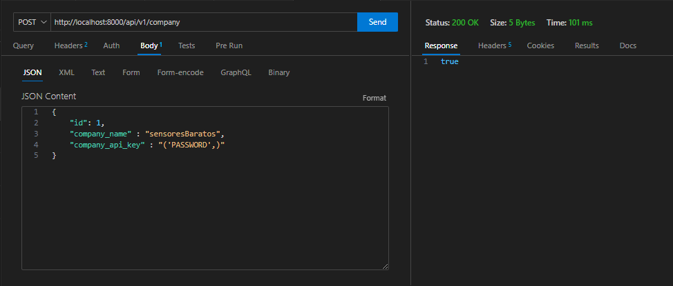

# Tarea3_Arq_Emergentes
API_REST_FLASK

## Aspectos a considerar

Se tienen 3 archivos de python database,Crud y app

### database: 

Contiene el modelo de base de datos en conjunto con sus relaciones y llaves primarias/foraneas, esto se realiza mediante un arreglo con las sentencias necesarias para crear las tablas para luego ejecutarlas mediante un for, además se tiene que crea un unico usuario admin con las credenciales:

**username: 'admin'**
**password: 'PASSWORD'**

Por otro lado se considero que para insertar datos en la tabla "company" el company_api_key debe ser el mismo que la contraseña del administrador, sino la inserción no se ejecutará, asimismo dentro de la petición de tipo json debe ir de la siguiente manera:

Cabe destacar que para la inserción del sensor_data ocurre lo mismo

### Crud

Aqui se tiene las sentencias SQL esenciales para poder obtener el funcionamiento esperado de la API, en donde se están separadas como funciones para ser llamadas desde **app.py**

### app

Aqui se tiene el principal funcionamiento del sistema en donde se lanza el servidor con ayuda de Flask, se definen los directorios de trabajo y finalmente se define el funcionamiento como tal

